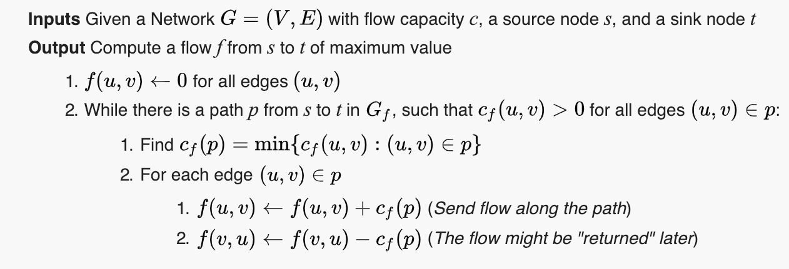

# Advanced algorithms and data structures

## Graphs
### Overview
Graph is a structure amounting to a set of objects in which some pairs of the objects are in some sense "related". The objects correspond to mathematical abstractions called vertices (also called nodes or points) and each of the related pairs of vertices is called an edge (also called an arc or line). Typically, a graph is depicted in diagrammatic form as a set of dots for the vertices, joined by lines or curves for the edges. Graphs are one of the objects of study in discrete mathematics.

The edges may be directed or undirected. For example, if the vertices represent people at a party, and there is an edge between two people if they shake hands, then this graph is undirected because any person A can shake hands with a person B only if B also shakes hands with A. In contrast, if any edge from a person A to a person B corresponds to A's admiring B, then this graph is directed, because admiration is not necessarily reciprocated. The former type of graph is called an undirected graph and the edges are called undirected edges while the latter type of graph is called a directed graph and the edges are called directed edges.

### Algorithms
#### Dijkstra's algorithm
Dijkstra's algorithm is an algorithm for finding the shortest paths between nodes in a graph, which may represent, for example, road networks. It was conceived by computer scientist Edsger W. Dijkstra in 1956 and published three years later.

The algorithm exists in many variants; Dijkstra's original variant found the shortest path between two nodes, but a more common variant fixes a single node as the "source" node and finds shortest paths from the source to all other nodes in the graph, producing a shortest-path tree.


Let the node at which we are starting be called the initial node. Let the distance of node Y be the distance from the initial node to Y. Dijkstra's algorithm will assign some initial distance values and will try to improve them step by step.

1. Mark all nodes unvisited. Create a set of all the unvisited nodes called the unvisited set.
2. Assign to every node a tentative distance value: set it to zero for our initial node and to infinity for all other nodes. Set the initial node as current.
3. For the current node, consider all of its unvisited neighbors and calculate their tentative distances through the current node. Compare the newly calculated tentative distance to the current assigned value and assign the smaller one. For example, if the current node A is marked with a distance of 6, and the edge connecting it with a neighbor B has length 2, then the distance to B through A will be 6 + 2 = 8. If B was previously marked with a distance greater than 8 then change it to 8. Otherwise, keep the current value.
4. When we are done considering all of the unvisited neighbors of the current node, mark the current node as visited and remove it from the unvisited set. A visited node will never be checked again.
5. If the destination node has been marked visited (when planning a route between two specific nodes) or if the smallest tentative distance among the nodes in the unvisited set is infinity (when planning a complete traversal; occurs when there is no connection between the initial node and remaining unvisited nodes), then stop. The algorithm has finished.
6. Otherwise, select the unvisited node that is marked with the smallest tentative distance, set it as the new "current node", and go back to step 3.

When planning a route, it is actually not necessary to wait until the destination node is "visited" as above: the algorithm can stop once the destination node has the smallest tentative distance among all "unvisited" nodes (and thus could be selected as the next "current").

```
 1  function Dijkstra(Graph, source):
 2
 3      create vertex set Q
 4
 5      for each vertex v in Graph:             // Initialization
 6          dist[v] ← INFINITY                  // Unknown distance from source to v
 7          prev[v] ← UNDEFINED                 // Previous node in optimal path from source
 8          add v to Q                          // All nodes initially in Q (unvisited nodes)
 9
10      dist[source] ← 0                        // Distance from source to source
11      
12      while Q is not empty:
13          u ← vertex in Q with min dist[u]    // Node with the least distance
14                                              // will be selected first
15          remove u from Q 
16          
17          for each neighbor v of u:           // where v is still in Q.
18              alt ← dist[u] + length(u, v)
19              if alt < dist[v]:               // A shorter path to v has been found
20                  dist[v] ← alt 
21                  prev[v] ← u 
22
23      return dist[], prev[]
```


## Trees
### Overview
In mathematics, and, more specifically, in graph theory, a tree is an undirected graph in which any two vertices are connected by exactly one path. Every acyclic connected graph is a tree, and vice versa. A forest is a disjoint union of trees, or equivalently an acyclic graph that is not necessarily connected.

The various kinds of data structures referred to as trees in computer science have underlying graphs that are trees in graph theory, although such data structures are generally rooted trees. A rooted tree may be directed, called a directed rooted tree, either making all its edges point away from the root—in which case it is called an arborescence, branching, or out-tree or making all its edges point towards the root—in which case it is called an anti-arborescence or in-tree. A rooted tree itself has been defined by some authors as a directed graph.

#### Definitions
##### Tree
A tree is an undirected graph G that satisfies any of the following equivalent conditions:

G is connected and acyclic (contains no cycles).
G is acyclic, and a simple cycle is formed if any edge is added to G.
G is connected, but would become disconnected if any single edge is removed from G.
G is connected and the 3-vertex complete graph K3 is not a minor of G.
Any two vertices in G can be connected by a unique simple path.
If G has finitely many vertices, say n of them, then the above statements are also equivalent to any of the following conditions:

G is connected and has n − 1 edges.
G is connected, and every subgraph of G includes at least one vertex with zero or one incident edges. (That is, G is connected and 1-degenerate.)
G has no simple cycles and has n − 1 edges.
As elsewhere in graph theory, the order-zero graph (graph with no vertices) is generally not considered to be a tree: while it is vacuously connected as a graph (any two vertices can be connected by a path), it is not 0-connected (or even (−1)-connected) in algebraic topology, unlike non-empty trees, and violates the "one more vertex than edges" relation. It may, however, be considered as a forest consisting of zero trees.

An internal vertex (or inner vertex or branch vertex) is a vertex of degree at least 2. Similarly, an external vertex (or outer vertex, terminal vertex or leaf) is a vertex of degree 1.

An irreducible tree (or series-reduced tree) is a tree in which there is no vertex of degree 2.

##### Forest
A forest is an undirected graph, all of whose connected components are trees; in other words, the graph consists of a disjoint union of trees. Equivalently, a forest is an undirected acyclic graph. As special cases, an empty graph, a single tree, and the discrete graph on a set of vertices (that is, the graph with these vertices that has no edges), are examples of forests. Since for every tree V - E = 1, we can easily count the number of trees that are within a forest by subtracting the difference between total vertices and total edges. TV - TE = number of trees in a forest.

##### Polytree
A polytree (or oriented tree or singly connected network) is a directed acyclic graph (DAG) whose underlying undirected graph is a tree. In other words, if we replace its directed edges with undirected edges, we obtain an undirected graph that is both connected and acyclic.

A directed tree is a directed graph which would be a tree if the directions on the edges were ignored, i.e. a polytree. Some authors restrict the phrase to the case where the edges are all directed towards a particular vertex, or all directed away from a particular vertex (see arborescence).

##### Rooted tree
A rooted tree is a tree in which one vertex has been designated the root. The edges of a rooted tree can be assigned a natural orientation, either away from or towards the root, in which case the structure becomes a directed rooted tree. When a directed rooted tree has an orientation away from the root, it is called an arborescence, branching, or out-tree; when it has an orientation towards the root, it is called an anti-arborescence or in-tree. The tree-order is the partial ordering on the vertices of a tree with u < v if and only if the unique path from the root to v passes through u. A rooted tree which is a subgraph of some graph G is a normal tree if the ends of every edge in G are comparable in this tree-order whenever those ends are vertices of the tree (Diestel 2005, p. 15). Rooted trees, often with additional structure such as ordering of the neighbors at each vertex, are a key data structure in computer science; see tree data structure.

In a context where trees are supposed to have a root, a tree without any designated root is called a free tree.

A labeled tree is a tree in which each vertex is given a unique label. The vertices of a labeled tree on n vertices are typically given the labels 1, 2, …, n. A recursive tree is a labeled rooted tree where the vertex labels respect the tree order (i.e., if u < v for two vertices u and v, then the label of u is smaller than the label of v).

In a rooted tree, the parent of a vertex is the vertex connected to it on the path to the root; every vertex except the root has a unique parent. A child of a vertex v is a vertex of which v is the parent. A descendant of any vertex v is any vertex which is either the child of v or is (recursively) the descendant of any of the children of v. A sibling to a vertex v is any other vertex on the tree which has the same parent as v. The root is an external vertex if it has precisely one child. A leaf is different from the root.

The height of a vertex in a rooted tree is the length of the longest downward path to a leaf from that vertex. The height of the tree is the height of the root. The depth of a vertex is the length of the path to its root (root path). This is commonly needed in the manipulation of the various self-balancing trees, AVL trees in particular. The root has depth zero, leaves have height zero, and a tree with only a single vertex (hence both a root and leaf) has depth and height zero. Conventionally, an empty tree (tree with no vertices, if such are allowed) has depth and height −1.

A k-ary tree is a rooted tree in which each vertex has at most k children. 2-ary trees are often called binary trees, while 3-ary trees are sometimes called ternary trees.

##### Ordered tree
An ordered tree (or plane tree) is a rooted tree in which an ordering is specified for the children of each vertex. This is called a "plane tree" because an ordering of the children is equivalent to an embedding of the tree in the plane, with the root at the top and the children of each vertex lower than that vertex. Given an embedding of a rooted tree in the plane, if one fixes a direction of children, say left to right, then an embedding gives an ordering of the children. Conversely, given an ordered tree, and conventionally drawing the root at the top, then the child vertices in an ordered tree can be drawn left-to-right, yielding an essentially unique planar embedding .

### Algorithms

#### Searching for a Specific Key
Assuming the tree is ordered, we can take a key and attempt to locate it within the tree. The following algorithms are generalized for binary search trees, but the same idea can be applied to trees of other formats.

##### Recursive
```
search-recursive(key, node)
    if node is NULL
        return EMPTY_TREE
    if key < node.key
        return search-recursive(key, node.left)
    else if key > node.key
        return search-recursive(key, node.right)
    else
        return node
```

##### Iterative
```
searchIterative(key, node)
    currentNode := node
    while currentNode is not NULL
        if currentNode.key = key
            return currentNode
        else if currentNode.key > key
            currentNode := currentNode.left
        else
            currentNode := currentNode.right
```


#### Searching for Min and Max
##### Minimum
```
findMinimum(node)
    if node is NULL
        return EMPTY_TREE
    min := node
    while min.left is not NULL
        min := min.left
    return min.key
```

##### Maximum
```
findMaximum(node)
    if node is NULL
        return EMPTY_TREE
    max := node
    while max.right is not NULL
        max := max.right
    return max.key
```
## Greedy algorithms

### Ford–Fulkerson algorithm
The Ford–Fulkerson method or Ford–Fulkerson algorithm (FFA) is a greedy algorithm that computes the maximum flow in a flow network. It is called a "method" instead of an "algorithm" as the approach to finding augmenting paths in a residual graph is not fully specified[1] or it is specified in several implementations with different running times.

The idea behind the algorithm is as follows: as long as there is a path from the source (start node) to the sink (end node), with available capacity on all edges in the path, we send flow along one of the paths. Then we find another path, and so on. A path with available capacity is called an augmenting path.


The path in step 2 can be found with for example a breadth-first search (BFS) or a depth-first search. If you use the former, the algorithm is called Edmonds–Karp.

When no more paths in step 2 can be found, s will not be able to reach t in the residual network. If S is the set of nodes reachable by s in the residual network, then the total capacity in the original network of edges from S to the remainder of V is on the one hand equal to the total flow we found from s to t, and on the other hand serves as an upper bound for all such flows. This proves that the flow we found is maximal. See also Max-flow Min-cut theorem.

### Activity selection problem
The activity selection problem is a combinatorial optimization problem concerning the selection of non-conflicting activities to perform within a given time frame, given a set of activities each marked by a start time (si) and finish time (fi). The problem is to select the maximum number of activities that can be performed by a single person or machine, assuming that a person can only work on a single activity at a time. The activity selection problem is also known as the Interval scheduling maximization problem (ISMP), which is a special type of the more general Interval Scheduling problem.

The activity selection problem is notable in that using a greedy algorithm to find a solution will always result in an optimal solution. A pseudocode sketch of the iterative version of the algorithm and a proof of the optimality of its result are included below.

```
Greedy-Iterative-Activity-Selector(A, s, f): 

    Sort A by finish times stored in f
    
    S = {A[1]} 
    k = 1
    
    n = A.length
    
    for i = 2 to n:
       if s[i] ≥ f[k]: 
           S = S U {A[i]}
           k = i
    
    return S
```