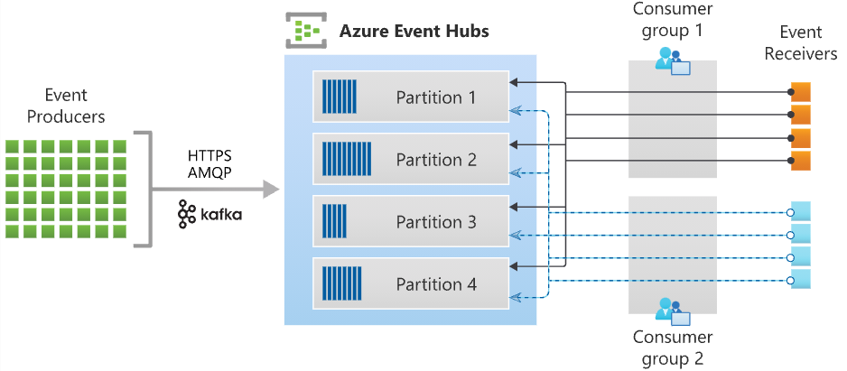

# Azure Event Hub

Big data streaming platform.

- PaaS;
- Real-time and batch processing;
- Capture event data - Azure Blob storage or Azure Data Lake Storage;
- Scalable;
- Rich ecosystem;

Concepts:
- Event hub clients - interface for devs via SKDs;
- Event hub producer - client, that serves as source of telemetry, diagnostic data;
- Event hub consumer - client, that reads information;
- Partition - ordered sequence of events in Hub;
- Consumer group - multiple consuming apps with separate view on stream;
- Event receivers - entity, that reads event data from the hub;
- Throughput unit / processing unit - pre-purchased units of capacity;



## Event Hubs Capture
Automatically capture the data from the Hub to the Blob or Lake;
Uses **Avro** format of the Hadoop ecosystem.

## Scale
- Scale - create multiple consumers responsible for their partitions;
- Load balance - increase/decrease consumers automatically;
- Seamless resume on fail - pick up partitions of failed consumer by another consumer;
- Consume events - code, that does something useful with events.

**EventHubConsumerClient** - client for processing messages.
**Partition ownership tracking** - track ownership on checkpoint store for autobalancing.

**Receiving messages** - must be relatively fast.
**Checkpointing** - committing last processed message within a partition.

## Controll access
MS Entra ID and SAS.
- Data Owner - complete access to Event Hub resources;
- Data Sender;
- Data Receiver.

Access via managed identities.

```C#
// Get partitions
var connectionString = "<< CONNECTION STRING FOR THE EVENT HUBS NAMESPACE >>";
var eventHubName = "<< NAME OF THE EVENT HUB >>";

await using (var producer = new EventHubProducerClient(connectionString, eventHubName))
{
    string[] partitionIds = await producer.GetPartitionIdsAsync();
}
```


```C#
// publish event
var connectionString = "<< CONNECTION STRING FOR THE EVENT HUBS NAMESPACE >>";
var eventHubName = "<< NAME OF THE EVENT HUB >>";

await using (var producer = new EventHubProducerClient(connectionString, eventHubName))
{
    using EventDataBatch eventBatch = await producer.CreateBatchAsync();
    eventBatch.TryAdd(new EventData(new BinaryData("First")));
    eventBatch.TryAdd(new EventData(new BinaryData("Second")));

    await producer.SendAsync(eventBatch);
}
```

```C#
// read events from the hub
var connectionString = "<< CONNECTION STRING FOR THE EVENT HUBS NAMESPACE >>";
var eventHubName = "<< NAME OF THE EVENT HUB >>";

string consumerGroup = EventHubConsumerClient.DefaultConsumerGroupName;

await using (var consumer = new EventHubConsumerClient(consumerGroup, connectionString, eventHubName))
{
    using var cancellationSource = new CancellationTokenSource();
    cancellationSource.CancelAfter(TimeSpan.FromSeconds(45));

    await foreach (PartitionEvent receivedEvent in consumer.ReadEventsAsync(cancellationSource.Token))
    {
        // At this point, the loop will wait for events to be available in the Event Hub.  When an event
        // is available, the loop will iterate with the event that was received.  Because we did not
        // specify a maximum wait time, the loop will wait forever unless cancellation is requested using
        // the cancellation token.
    }
}

// read from the partition
var connectionString = "<< CONNECTION STRING FOR THE EVENT HUBS NAMESPACE >>";
var eventHubName = "<< NAME OF THE EVENT HUB >>";

string consumerGroup = EventHubConsumerClient.DefaultConsumerGroupName;

await using (var consumer = new EventHubConsumerClient(consumerGroup, connectionString, eventHubName))
{
    EventPosition startingPosition = EventPosition.Earliest;
    string partitionId = (await consumer.GetPartitionIdsAsync()).First();

    using var cancellationSource = new CancellationTokenSource();
    cancellationSource.CancelAfter(TimeSpan.FromSeconds(45));

    await foreach (PartitionEvent receivedEvent in consumer.ReadEventsFromPartitionAsync(partitionId, startingPosition, cancellationSource.Token))
    {
        // At this point, the loop will wait for events to be available in the partition.  When an event
        // is available, the loop will iterate with the event that was received.  Because we did not
        // specify a maximum wait time, the loop will wait forever unless cancellation is requested using
        // the cancellation token.
    }
}
```

```C#
// processing with EventProcessorClient
var cancellationSource = new CancellationTokenSource();
cancellationSource.CancelAfter(TimeSpan.FromSeconds(45));

var storageConnectionString = "<< CONNECTION STRING FOR THE STORAGE ACCOUNT >>";
var blobContainerName = "<< NAME OF THE BLOB CONTAINER >>";

var eventHubsConnectionString = "<< CONNECTION STRING FOR THE EVENT HUBS NAMESPACE >>";
var eventHubName = "<< NAME OF THE EVENT HUB >>";
var consumerGroup = "<< NAME OF THE EVENT HUB CONSUMER GROUP >>";

Task processEventHandler(ProcessEventArgs eventArgs) => Task.CompletedTask;
Task processErrorHandler(ProcessErrorEventArgs eventArgs) => Task.CompletedTask;

var storageClient = new BlobContainerClient(storageConnectionString, blobContainerName);
var processor = new EventProcessorClient(storageClient, consumerGroup, eventHubsConnectionString, eventHubName);

processor.ProcessEventAsync += processEventHandler;
processor.ProcessErrorAsync += processErrorHandler;

await processor.StartProcessingAsync();

try
{
    // The processor performs its work in the background; block until cancellation
    // to allow processing to take place.

    await Task.Delay(Timeout.Infinite, cancellationSource.Token);
}
catch (TaskCanceledException)
{
    // This is expected when the delay is canceled.
}

try
{
    await processor.StopProcessingAsync();
}
finally
{
    // To prevent leaks, the handlers should be removed when processing is complete.

    processor.ProcessEventAsync -= processEventHandler;
    processor.ProcessErrorAsync -= processErrorHandler;
}
```

**EventHubConsumerClient** - simple client.
**EventProcessorClient** - advance client, for production solutions.
