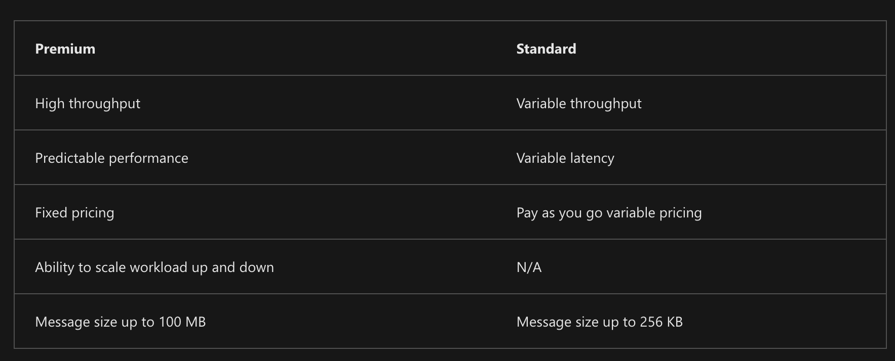

# Azure Message Queues

Service bus when:
- Receive messages without pooling;
- Guaranty FIFO order delivery;
- Auto duplicate deletion;
- Processing messages in-parallel as streams;
- Transaction behavior when sending / receiving multiple messages from the queue;
- Messages > 64 KB but < 256 KB;

Storage queues when:
- > 80 GB messages to store;
- Need to track progress of messages processing;
- We need service side logs of all txs executed against queue.

## Azure Service Bus
Fully-managed enterprise service broker.
- Messaging - transfer data as messages;
- Decouple applications;
- Topics and subscriptions - 1:n relation;
- Message sessions - workflows with messages ordering or deferral.



- Message sessions - enabling FIFO ordering;
- Auto forwarding - chains queue or subscription to another topic;
- Dead-letter queue - holds messages that can't be delivered;
- Scheduled delivery - messages with delayed processing;
- Message deferral - clients can defer retrieval of message;
- Batching - client-side batching like deferral but on the client side;
- Transactions - group operations into execution scope; Message entity can be queue, topic or subscription;
- Filtering and actions - subscribers define what messages from which topics they want to receive;
- Autodelete on idle - auto delete queue;
- Duplicate deletion - sender can resend message, queue or topic can discard duplicates;
- Security protocols - RBAC, SAS, Managed Identities;
- Geo-disaster recovery;
- AMQP and HTTP/REST.

### Queues
FIFO message delivery for one or more consumers.
**Load leveling** allows to produce and consume messages in different speed.

#### Receive and delete
Deletes message when received request from the consumer for a message.

#### Peek lock
1. Next message to consume is locked, sends it to consumer;
2. Consumer processed message and sends ACK to queue to mark msg as consumed.

### Topics and subscriptions
Queue - single consumer. Topic and subscription - multiple consumers.

1 topic contains several subscriptions. One message in topic is available for all subscriptions.

#### Filtering
Subscriber can specify which messages from a topic to receive by subscription rules - filter statements.

Rules without action combined as OR. With actions copies messages.

Filter rules:
- SQL filters - SQL-like conditional expression
- Boolean filters - TrueRuleFilter or FalseRuleFilter - enables and disables arriving of messages;
- Correlation filters - more efficient that SQL. Do basically the same.

Filter actions - can add, replace or remove message properties.
- Broadcast pattern - every subscription gets a copy of each message sent to a topic;
- Partitioning pattern - partition messages across topics in mutually exclusive manner;
- Routing pattern - distribute messages across topics not necessarily exclusive.


### Payload and serialization
Metadata - key-value pairs.

### Routing
Broker properties used for routing: To, ReplyTo, ReplyToSessionId, MessageId, CorrelationId, and SessionId.

- Simple request/reply - in reply message: MessageId -> CorrelationId, destination = ReplyTo;
- Multicast request/reply - ReplyTo can be point to the topic;
- Multiplexing - multiplex several streams of related messages in one queue or subscription by SessionId;
- Multiplexed request/reply - ReplyToSessionId is used for replies.

Payload is opaque binary block.

### Example
#### Send messages
```C#
// the client that owns the connection and can be used to create senders and receivers
ServiceBusClient client;

// the sender used to publish messages to the queue
ServiceBusSender sender;

// Create the clients that we'll use for sending and processing messages.
client = new ServiceBusClient(connectionString);
sender = client.CreateSender(queueName);

// create a batch 
using ServiceBusMessageBatch messageBatch = await sender.CreateMessageBatchAsync();

for (int i = 1; i <= 3; i++)
{
    // try adding a message to the batch
    if (!messageBatch.TryAddMessage(new ServiceBusMessage($"Message {i}")))
    {
        // if an exception occurs
        throw new Exception($"Exception {i} has occurred.");
    }
}

try
{
    // Use the producer client to send the batch of messages to the Service Bus queue
    await sender.SendMessagesAsync(messageBatch);
    Console.WriteLine($"A batch of three messages has been published to the queue.");
}
finally
{
    // Calling DisposeAsync on client types is required to ensure that network
    // resources and other unmanaged objects are properly cleaned up.
    await sender.DisposeAsync();
    await client.DisposeAsync();
}

Console.WriteLine("Follow the directions in the exercise to review the results in the Azure portal.");
Console.WriteLine("Press any key to continue");
Console.ReadKey();
```

#### Receive messages
```C#
ServiceBusProcessor processor;
client = new ServiceBusClient(connectionString);

// create a processor that we can use to process the messages
processor = client.CreateProcessor(queueName, new ServiceBusProcessorOptions());

try
{
    // add handler to process messages
    processor.ProcessMessageAsync += MessageHandler;

    // add handler to process any errors
    processor.ProcessErrorAsync += ErrorHandler;

    // start processing 
    await processor.StartProcessingAsync();

    Console.WriteLine("Wait for a minute and then press any key to end the processing");
    Console.ReadKey();

    // stop processing 
    Console.WriteLine("\nStopping the receiver...");
    await processor.StopProcessingAsync();
    Console.WriteLine("Stopped receiving messages");
}
finally
{
    // Calling DisposeAsync on client types is required to ensure that network
    // resources and other unmanaged objects are properly cleaned up.
    await processor.DisposeAsync();
    await client.DisposeAsync();
}

// handle received messages
async Task MessageHandler(ProcessMessageEventArgs args)
{
    string body = args.Message.Body.ToString();
    Console.WriteLine($"Received: {body}");

    // complete the message. messages is deleted from the queue. 
    await args.CompleteMessageAsync(args.Message);
}

// handle any errors when receiving messages
Task ErrorHandler(ProcessErrorEventArgs args)
{
    Console.WriteLine(args.Exception.ToString());
    return Task.CompletedTask;
}
```

## Azure Queue Storage
Service for storing large numbers of messages.

### Create queue
```C#
// Get the connection string from app settings
string connectionString = ConfigurationManager.AppSettings["StorageConnectionString"];

// Instantiate a QueueClient which will be used to create and manipulate the queue
QueueClient queueClient = new QueueClient(connectionString, queueName);

// Create the queue
queueClient.CreateIfNotExists();
```

### Insert message
```C#
// Get the connection string from app settings
string connectionString = ConfigurationManager.AppSettings["StorageConnectionString"];

// Instantiate a QueueClient which will be used to create and manipulate the queue
QueueClient queueClient = new QueueClient(connectionString, queueName);

// Create the queue if it doesn't already exist
queueClient.CreateIfNotExists();

if (queueClient.Exists())
{
    // Send a message to the queue
    queueClient.SendMessage(message);
}
```

### Pick message
```C#
// Get the connection string from app settings
string connectionString = ConfigurationManager.AppSettings["StorageConnectionString"];

// Instantiate a QueueClient which will be used to manipulate the queue
QueueClient queueClient = new QueueClient(connectionString, queueName);

if (queueClient.Exists())
{ 
    // Peek at the next message
    PeekedMessage[] peekedMessage = queueClient.PeekMessages();
}
```

### Update message
```C#
// Get the connection string from app settings
string connectionString = ConfigurationManager.AppSettings["StorageConnectionString"];

// Instantiate a QueueClient which will be used to manipulate the queue
QueueClient queueClient = new QueueClient(connectionString, queueName);

if (queueClient.Exists())
{
    // Get the message from the queue
    QueueMessage[] message = queueClient.ReceiveMessages();

    // Update the message contents
    queueClient.UpdateMessage(message[0].MessageId, 
            message[0].PopReceipt, 
            "Updated contents",
            TimeSpan.FromSeconds(60.0)  // Make it invisible for another 60 seconds
        );
}
```

### Dequeue message
```C#
// Get the connection string from app settings
string connectionString = ConfigurationManager.AppSettings["StorageConnectionString"];

// Instantiate a QueueClient which will be used to manipulate the queue
QueueClient queueClient = new QueueClient(connectionString, queueName);

if (queueClient.Exists())
{
    // Get the next message
    QueueMessage[] retrievedMessage = queueClient.ReceiveMessages();

    // Process (i.e. print) the message in less than 30 seconds
    Console.WriteLine($"Dequeued message: '{retrievedMessage[0].Body}'");

    // Delete the message
    queueClient.DeleteMessage(retrievedMessage[0].MessageId, retrievedMessage[0].PopReceipt);
}
```