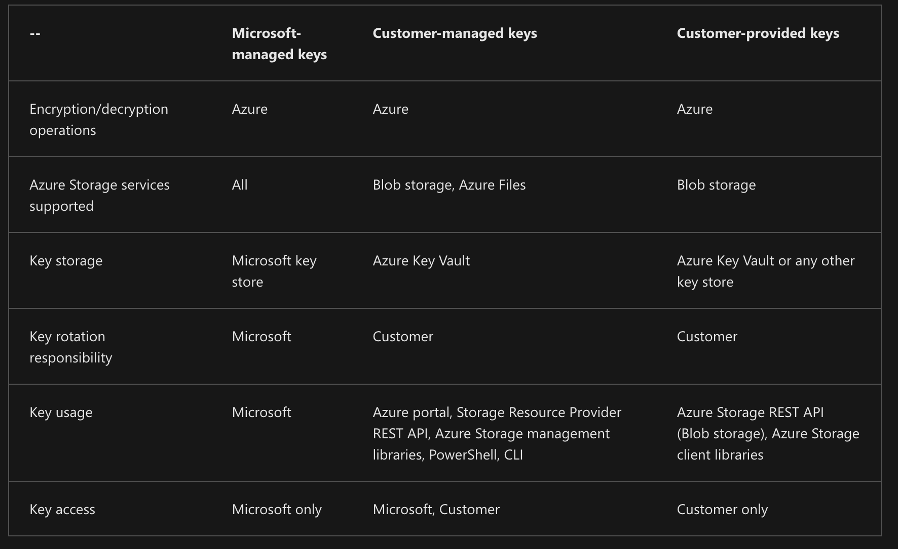
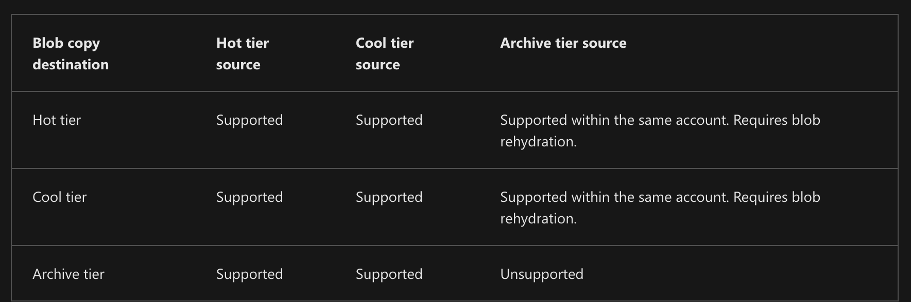

# Azure Storage Accounts

## Blob storage
Container for storage files.

- Standard - general purpose, for most scenarios. (Blob, file share, queues, tables)
- Premium (has less redundancy options, maybe block and page storage, low latency option). **Can be block blob, page blob and file share;**
- - Block blob (or append blob) - high transaction rates, smaller objects or require consistency low latency
- - Page blobs only

Tiers:
- Hot tier - frequent access;
- Cool - infrequent access, stored at least 30 days;
- Cold - >90 days (higher access cost, lower storage cost);
- Archive - >180 days, only for individual block blobs, 

Advanced options:
- Access to the HTTP
- Public access to some files or containers
- Storage account keys - keys for admin access (alternative is AD)
- Enable Data lake storage for big amount of data

Resource types:
- The storage account - namespace for data;
- A container in the storage account - analog of a directory
- A blob in a container 
- - Block blob (file)
- - Append blob (logging) - optimized for append operations
- - Page blob - can store random access file (like virtual HD for VM).

Security:
- All data encrypted;
- MS Entra ID and RBAC are supported;
- Data transfer between storage and app can be encrypted as well;
- Disks with data are encrypted as well;
- SAS can be user for granting an access to the data;



### Blob storage lifecycle policies:
Each rule definition includes a filter set and an action set. The filter set limits rule actions to a certain set of objects within a container or objects names. The action set applies the tier or delete actions to the filtered set of objects.

Rules allows to move blobs to different tiers or delete.

Filters:
- blobTypes
- prefixMatch
- blobIndexMatch

Actions:
- tierToCool - blockBlob only;
- enableAutoTierToHotFromCool - blockBlob only;
- tierToArchive - blockBlob only;
- delete - blockBlob and appendBlob;

Conditions:
- daysAfterModificationGreaterThan
- daysAfterCreationGreaterThan
- daysAfterLastAccessTimeGreaterThan
- daysAfterLastTierChangeGreaterThan

Rehydration of archived tier:
- Copy from offline to online blob (CopyBlob or CopyBlobFromUrl)
- Change access tier tier from offline to online (SetBlobTier)
- - Standard priority - up to 15 hours
- - High priority - < 1h for objects < 10 GB size




Networking:
- Public for internet
- Public for whitelist
- Private access only

Routing:
- MS network (internal network between DCs)
- Internet

Encryption:
- MS key
- Customer key

Infrastructure encryption - second layer of encryption between hardware and software.

Access keys - admin keys, not for regular use.
Shared access signature - more granular way to generate key for interaction with storage, that contain only required permissions.
SAS and stored access policy cannot be revoked.

Data protection allows to configure Data backups for storage account.

Lifecycle management - adding lifecycle policies.

### AzCopy
Copying without downloading and uploading files locally.
```bash
azcopy copy 'https://source-url...with...auth' 'https://dest-url'
```

Static web app - ability to host static pages inside storage account with a web server.

### SDK
- `BlobServiceClient` - storage account
- `BlobContainerClient` - blob container
- `BlobClient` - blob a.k.a. file
- `AppendBlobClient` - appending data to the blob
- `BlockBlobClient` - Represents a block blob, and provides operations specific to block blobs, such as staging and then committing blocks of data.


