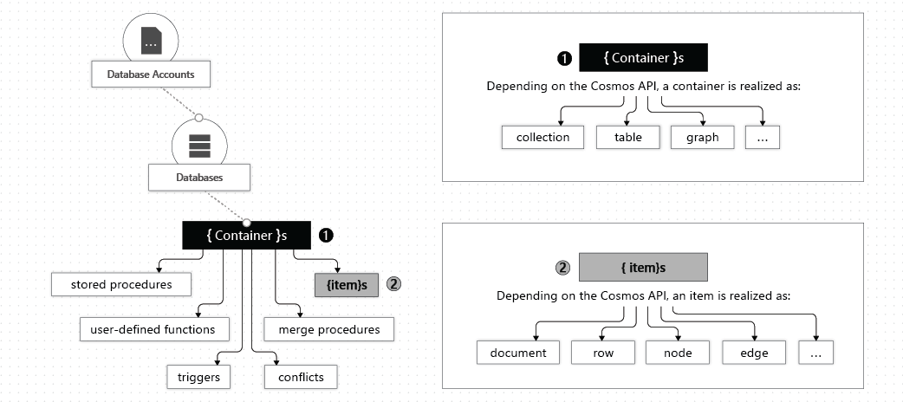

# Azure CosmosDB
NoSQL database.



- Database - namespace;
- Container - unit of scalability; Can be partitioned;
- - Dedicated provisioned throughput mode - reserved throughput for container;
- - Shared provisioned throughput mode - reserved throughput for all containers of the database;
- Item - container item of any type (document, row, node, edge).

## Consistency
- Strong - read always returns the latest committed write;
- Bounded staleness - lag of inconsistency between reads and writes can be specified in number of writes or seconds;
- Session - single client reads with consistent-prefix, monotonic reads and writes, read-your-writes and write-follows-reads;
- Consistent prefix - consistency guaranteed sequence of writes on all replicas;
- Eventual - no guarantees.

## API
- Azure Cosmos DB for NoSQL - data in document format, supports SQL for querying;
- Azure Cosmos DB for MongoDB - document structure data (BSON)
- Azure Cosmos DB for PostgreSQL - distributed tables, single or multi node config;
- Azure Cosmos DB for Apache Cassandra - column-oriented schema
- Azure Cosmos DB for Table - key/value format
- Azure Cosmos DB for Apache Gremlin - data as nodes and edges, supports graph queries.

## Request units (RU)
- Provisioned throughput mode - order RU amount, can be changed programmatically;
- Serverless mode - no provision, just pay-as-you-go;
- Autoscale mode - as first but with autoscale.

## Usage

### Create DB
```bash
az group create --location <myLocation> --name az204-cosmos-rg

# create db
az cosmosdb create --name <myCosmosDBacct> --resource-group az204-cosmos-rg

# Retrieve the primary key
az cosmosdb keys list --name <myCosmosDBacct> --resource-group az204-cosmos-rg

dotnet add package Microsoft.Azure.Cosmos
```

### C# client

```C#
// Create a new instance of the Cosmos Client
this.cosmosClient = new CosmosClient(EndpointUri, PrimaryKey);

// Create DB
this.database = await this.cosmosClient.CreateDatabaseIfNotExistsAsync(databaseId);

// Create container
this.container = await this.database.CreateContainerIfNotExistsAsync(containerId, "/LastName");
```

### Stored procedures
```js
// stored procedure example
var helloWorldStoredProc = {
    id: "helloWorld",
    serverScript: function () {
        var context = getContext();
        var response = context.getResponse();

        response.setBody("Hello, World");
    }
}

var createDocumentStoredProc = {
    id: "createMyDocument",
    body: function createMyDocument(documentToCreate) {
        var context = getContext();
        var collection = context.getCollection();
        var accepted = collection.createDocument(collection.getSelfLink(),
              documentToCreate,
              function (err, documentCreated) {
                  if (err) throw new Error('Error' + err.message);
                  context.getResponse().setBody(documentCreated.id)
              });
        if (!accepted) return;
    }
}
```

## Change feed
CosmosDB has change feed, that publish any modifications of the documents.

- Monitored container - monitored for insert and update operations;
- Lease container - storage mechanism for several feed consumers;
- Host (Compute instance) - app, that listens and reacts on the feed;
- Delegate - code in the app with business logic for each batch operation.

### Push and Pull models
- Push model - auto balance, processing state is in the lease container;
- Pull model - if need to check changes from particular partition.