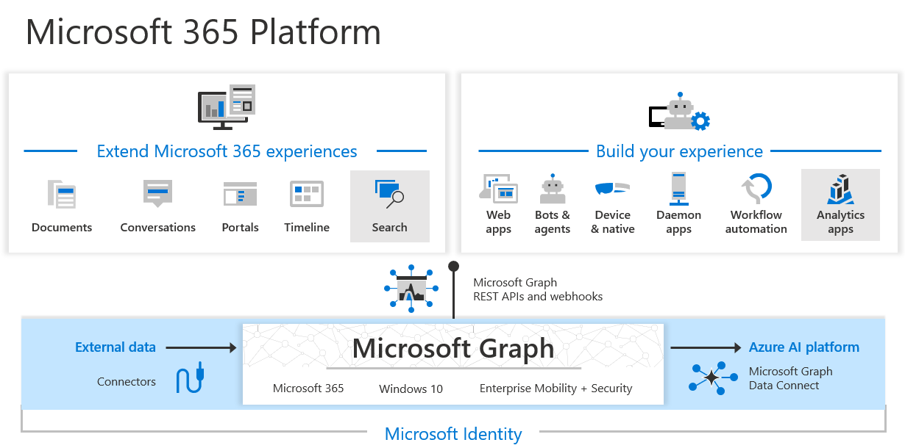

# Microsoft Identity Platform

Tenant is a directory in MS Entra ID must be registered. It can be
- Single tenant: only accessible in your tenant;
- Multi-tenant: accessible in other tenants.

Root of the tenant is "application object".
Security principals - access to a resource, access policy and permissions.
- Application - representation of the app 
- Managed identity - Managed identities provide an identity for applications to use when connecting to resources that support Microsoft Entra authentication.

The **application object** is the global representation of your application for use across all tenants, and the **service principal** is the local representation for use in a specific tenant.

## Permissions and consent
Permission types:
- Delegated permissions - used by apps that have a signed-in user present;
- App-only access permissions - used by apps that run without a signed-in user present, for example, apps that run as background services or daemons.

Consent types:
- Static user consent - all permissions must be granted by a user to an app.
- Incremental and dynamic user consent - request permissions incrementally
- Admin consent - some permissions may be granted to the app via tenant administrator where the app was registered.

### Conditional access
MFA, enrolled devices, restricted locations check.


## Microsoft Authentication Library (MSAL)
MSAL has lot of versions for different platforms.


### OAuth Flows
- Authorization code grant - app uses code (that received after redirect) to acquire access token;
- Client credentials - app credentials for access token (server2server);
- Device code flow - auth of device which user approves on another device;
- On-Behalf-of flow - access token of the user is used by API A to obtain access token to the API B.
- Implicit grant flow - hybrid with access token and cookies;
- Resource owner password credentials - user passes credentials to the client app, client app send them to acquire the access token.

## Shared Access Signatures (SAS)
SAS - signed URL includes token and points to a storage account resource.

- User delegation SAS: A user delegation SAS is secured with Microsoft Entra credentials and also by the permissions specified for the SAS. For Blob storage only.
- Service SAS - secured by storage account key - access to the resource in blob, queue, table, files.
- Account SAS - secured by storage account key - access to the resources in several storage services.

### Best practices:
- HTTPS against man-in-the-middle;
- Better to use user-delegated SAS;
- Smallest possible expiration time;
- Minimum-required privileges;
- Middle-tier service to manage users access to the storage;

### Patterns:
- Uploading through front-end proxy with client auth to the storage;
- SAS provider to get SAS to client, and that direct access to the storage via SAS;

### Stored access policies
- Blob containers
- File shares
- Queues
- Tables

Policy of the container can be used for all blobs of the container and for container itself.
Policy - identifier, start time, end time, permissions.

```C#
// Create Service SAS to Blob
public static async Task<Uri> CreateServiceSASBlob(
    BlobClient blobClient,
    string storedPolicyName = null)
{
    // Check if BlobContainerClient object has been authorized with Shared Key
    if (blobClient.CanGenerateSasUri)
    {
        // Create a SAS token that's valid for one day
        BlobSasBuilder sasBuilder = new BlobSasBuilder()
        {
            BlobContainerName = blobClient.GetParentBlobContainerClient().Name,
            BlobName = blobClient.Name,
            Resource = "b"
        };

        if (storedPolicyName == null)
        {
            sasBuilder.ExpiresOn = DateTimeOffset.UtcNow.AddDays(1);
            sasBuilder.SetPermissions(BlobContainerSasPermissions.Read);
        }
        else
        {
            sasBuilder.Identifier = storedPolicyName;
        }

        Uri sasURI = blobClient.GenerateSasUri(sasBuilder);

        return sasURI;
    }
    else
    {
        // Client object is not authorized via Shared Key
        return null;
    }
}
```

## Microsoft Graph

- API - endpoint to access data;
- Connectors - puts data into the MS cloud from external sources like Google Drive, Jira, Salesforce;
- Data connect - delivery of Graph data to the MS data storages.

