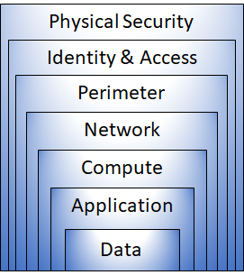

# Microsoft Azure Fundamentals

## Describe cloud concepts


### Cloud models
- Private cloud - infrastructure in the dedicated data center for particular company.
- Public cloud - maintained and owned by third-party cloud provider, anyone can consume that resources.


Azure Arc - tool for management of cloud resources and infrastructure.

### Consumption-based model
Pay-as-you-go model. Pay only for usage of resources.

### Summary
- Define cloud computing.
- Describe the shared responsibility model.
- Define cloud models, including public, private, and hybrid.
- Identify appropriate use cases for each cloud model.
- Describe the consumption-based model.
- Compare cloud pricing models.

## Benefits of using cloud services 
**Reliability** - ability to recover from failures and continue work.

**Predictability** - ability to predict cost consumption. Influenced by Microsoft Azure Well-Architected Framework.
**Performance** - autoscaling, load balancing, and high availability.
**Cost** - Total Cost of Ownership (TCO) or Pricing Calculator tools for cost calculations.

Security and governance in the cloud may be managed by cloud provider or by customer according to its or local standards.

## Cloud service types 
### IaaS
OS and higher are responsibility of the customer.

Scenarios:
- Lift-and-shift migration: You’re setting up cloud resources similar to your on-prem datacenter, and then simply moving the things running on-prem to running on the IaaS infrastructure.
- Testing and development: You have established configurations for development and test environments that you need to rapidly replicate. You can start up or shut down the different environments rapidly with an IaaS structure, while maintaining complete control.

### PaaS
Cloud provider maintains the physical infrastructure, physical security, and connection to the internet. They also maintain the operating systems, middleware, development tools, and business intelligence services that make up a cloud solution.

Scenarios:
- Development framework: PaaS provides a framework that developers can build upon to develop or customize cloud-based applications. Similar to the way you create an Excel macro, PaaS lets developers create applications using built-in software components. Cloud features such as scalability, high-availability, and multi-tenant capability are included, reducing the amount of coding that developers must do.
- Analytics or business intelligence: Tools provided as a service with PaaS allow organizations to analyze and mine their data, finding insights and patterns and predicting outcomes to improve forecasting, product design decisions, investment returns, and other business decisions.

### SaaS
Only data, accounts and devices access are on the customer.

Scenarios:
- Email and messaging.
- Business productivity applications.
- Finance and expense tracking.

## Azure architecture and services
Structure:


```bash
az upgrade # upgrade CLI
az interactive # starts interactive mode with autocomplete
```

### Physical infrastructure
Datacenters around the worlds are grouped into Azure Regions or Azure Availability Zones.

#### Regions
A region is a geographical area on the planet that contains at least one, but potentially multiple datacenters.

### Availability Zones
Availability zones are physically separate datacenters within an Azure region.

Availability zones are primarily for VMs, managed disks, load balancers, and SQL databases. Azure services that support availability zones fall into three categories:
- Zonal services: You pin the resource to a specific zone (for example, VMs, managed disks, IP addresses).
- Zone-redundant services: The platform replicates automatically across zones (for example, zone-redundant storage, SQL Database).
- Non-regional services: Services are always available from Azure geographies and are resilient to zone-wide outages as well as region-wide outages.

### Region pairs
For example, if a region in a pair was affected by a natural disaster, services would automatically fail over to the other region in its region pair.

### Azure management infrastructure
#### Resource groups
A resource is the basic building block of Azure. Multiply resources in one resource group.

#### Subscriptions
Subscriptions are a unit of management, billing and scale.
There are two types of subscription boundaries that you can use:
- Billing boundary: This subscription type determines how an Azure account is billed for using Azure. You can create multiple subscriptions for different types of billing requirements. 
- Access control boundary: Azure applies access-management policies at the subscription level, and you can create separate subscriptions to reflect different organizational structures. 

#### Azure management groups
Azure management groups provide a level of scope above subscriptions. 
Examples:
- Create a hierarchy that applies a policy. You could limit VM locations to the US West Region in a group called Production. 
- Provide user access to multiple subscriptions. By moving multiple subscriptions under a management group, you can create one Azure role-based access control (Azure RBAC) assignment on the management group.

## Azure compute and networking services
### VMs
VMs provide infrastructure as a service (IaaS).
- Total control over the operating system (OS).
- The ability to run custom software.
- To use custom hosting configurations.

VMs can be grouped together to provide high availability, scalability, and redundancy. Azure can also manage the grouping of VMs for you with features such as scale sets and availability sets.

#### VM scale sets
Scale set - group of identical, load-balanced VMs. Increasing decreasing may be on conditional demand or on schedule.

#### VM availability sets
- Update domain: The update domain groups VMs that can be rebooted at the same time. This allows you to apply updates while knowing that only one update domain grouping will be offline at a time. All of the machines in one update domain will be updated. An update group going through the update process is given a 30-minute time to recover before maintenance on the next update domain starts.
- Fault domain: The fault domain groups your VMs by common power source and network switch. By default, an availability set will split your VMs across up to three fault domains. This helps protect against a physical power or networking failure by having VMs in different fault domains (thus being connected to different power and networking resources).

#### When to use VMs
- During testing and development.
- When running applications in the cloud.
- When extending your datacenter to the cloud.
- During disaster recovery.

#### Creation
```bash
# create VM
az vm create \
  --resource-group "[sandbox resource group name]" \
  --name my-vm \
  --public-ip-sku Standard \
  --image Ubuntu2204 \
  --admin-username azureuser \
  --generate-ssh-keys    

# deploy nginx
az vm extension set \
  --resource-group "[sandbox resource group name]" \
  --vm-name my-vm \
  --name customScript \
  --publisher Microsoft.Azure.Extensions \
  --version 2.1 \
  --settings '{"fileUris":["https://raw.githubusercontent.com/MicrosoftDocs/mslearn-welcome-to-azure/master/configure-nginx.sh"]}' \
  --protected-settings '{"commandToExecute": "./configure-nginx.sh"}'    
```

### Azure virtual desktop
Solution of workstations virtualization.

### Azure containers
Ability to host containerized app.
- Azure Container Instances - allows to run containerized app
- Azure Container Apps - the same but with load balancing and scaling
- Azure Kubernetes Service - container orchestration service

### Azure functions
Azure Functions is an event-driven, serverless compute option.
Stateless and stateful (durable).

### Azure App Service
App Service enables you to build and host web apps, background jobs, mobile back-ends, and RESTful APIs in the programming language of your choice without managing infrastructure.
- Web apps
- API apps
- WebJobs
- Mobile apps

### Azure virtual networking
Configuration of communication between resources.
- Isolation and segmentation - networks can be private.
- Internet communications - resource can have public IP or public load balancer
- Communicate between Azure resources - provides secure and effective way of communication
- Communicate with on-premises resources
- - Point-to-site virtual private network - VPN to Azure network
- - Site-to-site virtual private network - on-premise VPN or gateway to Azure network
- - Azure ExpressRoute provides a dedicated private connectivity to Azure that doesn't travel over the internet.
- Route network traffic - routing tables and Border Gateway Protocol to configure traffic routing
- Filter network traffic - Network security groups can contain security rules for filtering traffic. Network virtual appliances are specialized VMs that can be compared to a hardened network appliance. 
- Connect virtual networks - You can link virtual networks together by using virtual network peering. Peering allows two virtual networks to connect directly to each other. 

#### Network configuration
```bash
az vm list-ip-addresses # get VM IP addresses

# the same but stored in the variable
IPADDRESS="$(az vm list-ip-addresses \
  --resource-group "[sandbox resource group name]" \
  --name my-vm \
  --query "[].virtualMachine.network.publicIpAddresses[*].ipAddress" \
  --output tsv)"    

curl --connect-timeout 5 http://$IPADDRESS

# list network security groups
az network nsg list \
  --resource-group "[sandbox resource group name]" \
  --query '[].name' \
  --output tsv    

# list rules of particular network
az network nsg rule list \
  --resource-group "[sandbox resource group name]" \
  --nsg-name my-vmNSG    

# the same, but with query and table output
az network nsg rule list \
  --resource-group "[sandbox resource group name]" \
  --nsg-name my-vmNSG \
  --query '[].{Name:name, Priority:priority, Port:destinationPortRange, Access:access}' \
  --output table    


# create new rule to allow traffic over 80 port
az network nsg rule create \
  --resource-group "[sandbox resource group name]" \
  --nsg-name my-vmNSG \
  --name allow-http \
  --protocol tcp \
  --priority 100 \
  --destination-port-range 80 \
  --access Allow    
```

#### Azure virtual private networks
A virtual private network (VPN) uses an encrypted tunnel within another network.

##### VPN gateways
- Connect on-premises datacenters to virtual networks through a site-to-site connection.
- Connect individual devices to virtual networks through a point-to-site connection.
- Connect virtual networks to other virtual networks through a network-to-network connection.

**Active/standby** - each gateway has its standby copy for switching in case when active instance needed a maintenance of had a failure.

**Active/active** - two active gateways with two public IP and two tunnels, which supported by BGP routing protocol.

**ExpressRoute failover** - Another high-availability option is to configure a VPN gateway as a secure failover path for ExpressRoute connections.

**Zone-redundant gateways** - In regions that support availability zones, VPN gateways and ExpressRoute gateways can be deployed in a zone-redundant configuration.

#### Azure ExpressRoute
Azure ExpressRoute lets you extend your on-premises networks into the Microsoft cloud over a private connection, with the help of a connectivity provider.
Connectivity can be from an any-to-any (IP VPN) network, a point-to-point Ethernet network, or a virtual cross-connection through a connectivity provider at a colocation facility.

- Connectivity to Microsoft cloud services across all regions in the geopolitical region.
- Global connectivity to Microsoft services across all regions with the ExpressRoute Global Reach.
- Dynamic routing between your network and Microsoft via Border Gateway Protocol (BGP).
- Built-in redundancy in every peering location for higher reliability.

#### Azure DNS
Azure DNS is a hosting service for DNS domains that provides name resolution by using Microsoft Azure infrastructure.

## Azure storage services
### Azure storage accounts
Namespace for your Azure Storage. Includes blob storage, table storage, data lake, Azure files, queue. Has several redundancy options.

### Azure storage redundancy
Redundancy in the primary region: 
- Locally redundant storage - 3 replicas in the DC of the primary region.   
- Zone-redundant storage - 3 sync replicas across three Azure availability zones in the primary region.

Redundancy in a secondary region:
- Geo-redundant storage - sync LRS in primary region and async LRS to the secondary region.
- Geo-zone-redundant storage - three Azure availability zones in the primary region and to a secondary geographic region, using LRS.

Read access to data in the secondary region - read access available only during failover by default. This option can enable read access when primary region is OK.

### Azure Blobs
Storage for binary data: images, text etc.
Blob storage is ideal for:
- Serving images or documents directly to a browser.
- Storing files for distributed access.
- Streaming video and audio.
- Storing data for backup and restore, disaster recovery, and archiving.
- Storing data for analysis by an on-premises or Azure-hosted service.

#### Blob storage tiers
- Hot access tier: Optimized for storing data that is accessed frequently (for example, images for your website).
- Cool access tier: Optimized for data that is infrequently accessed and stored for at least 30 days (for example, invoices for your customers).
- Cold access tier: Optimized for storing data that is infrequently accessed and stored for at least 90 days.
- Archive access tier: Appropriate for data that is rarely accessed and stored for at least 180 days, with flexible latency requirements (for example, long-term backups).

### Azure Files
File shares over Server Message Block (SMB) or Network File System (NFS) protocols.

### Azure Queues
Service for storing large numbers of messages.

### Azure Disks
Azure Disk storage, or Azure managed disks, are block-level storage volumes managed by Azure for use with Azure VMs.

### Azure Tables
Azure Table storage stores large amounts of structured data. Azure tables are a NoSQL datastore that accepts authenticated calls from inside and outside the Azure cloud.

### Azure data migration options
#### Azure Migrate
Service, that helps migrate from on premises to cloud.

#### Azure Data Box
Azure Data Box is a physical migration service that helps transfer large amounts of data in a quick, inexpensive, and reliable way. 

#### AzCopy
AzCopy is a command-line utility that you can use to copy blobs or files to or from your storage account.


## Azure Identity, access, and security 
### Microsoft Entra ID
Cloud analogue of Active Directory.
- Authentication
- Single sign-on
- Application management
- Device management

Microsoft Entra Connect synchronizes user identities between on-premises Active Directory and Microsoft Entra ID.

### Microsoft Entra Domain Services
Microsoft Entra Domain Services is a service that provides managed domain services such as domain join, group policy, lightweight directory access protocol (LDAP), and Kerberos/NTLM authentication.

### Azure authentication methods


Single sign-on (SSO) enables a user to sign in one time and use that credential to access multiple resources and applications from different providers.

Single sign-on (SSO) - One sign-in point to authenticate in different services and apps.
Multifactor auth, Passwordless auth, Hello for business, MS Authenticator App

The FIDO (Fast IDentity Online) Alliance helps to promote open authentication standards and reduce the use of passwords as a form of authentication. USB, BT or NFC device for auth.

### Azure external identities
User brings its identity from third-party service.


- Business to business (B2B) collaboration - Collaborate with external users by letting them use their preferred identity to sign-in to your Microsoft applications or other enterprise applications (SaaS apps, custom-developed apps, etc.). B2B collaboration users are represented in your directory, typically as guest users.
- B2B direct connect - Establish a mutual, two-way trust with another Microsoft Entra organization for seamless collaboration. B2B direct connect currently supports Teams shared channels, enabling external users to access your resources from within their home instances of Teams. B2B direct connect users aren't represented in your directory, but they're visible from within the Teams shared channel and can be monitored in Teams admin center reports.
- Microsoft Azure Active Directory business to customer (B2C) - Publish modern SaaS apps or custom-developed apps (excluding Microsoft apps) to consumers and customers, while using Azure AD B2C for identity and access management.

### Azure conditional access
Conditional Access is a tool that Microsoft Entra ID uses to allow (or deny) access to resources based on identity signals. These signals include who the user is, where the user is, and what device the user is requesting access from.

- Require multifactor authentication (MFA) to access an application depending on the requester’s role, location, or network. For example, you could require MFA for administrators but not regular users or for people connecting from outside your corporate network.
- Require access to services only through approved client applications. For example, you could limit which email applications are able to connect to your email service.
- Require users to access your application only from managed devices. A managed device is a device that meets your standards for security and compliance.
- Block access from untrusted sources, such as access from unknown or unexpected locations.

### Azure role-based access control
The least privilege principle. Users can have roles, roles have scopes.


### Zero trust model
Zero Trust is a security model that assumes the worst case scenario and protects resources with that expectation.

- Verify explicitly - Always authenticate and authorize based on all available data points.
- Use least privilege access - Limit user access with Just-In-Time and Just-Enough-Access (JIT/JEA), risk-based adaptive policies, and data protection.
- Assume breach - Minimize blast radius and segment access. Verify end-to-end encryption. Use analytics to get visibility, drive threat detection, and improve defenses.

### Defense-in-depth

Each layer has its protection mechanism.

- The physical security layer is the first line of defense to protect computing hardware in the datacenter.
- The identity and access layer controls access to infrastructure and change control. SSO, control access, audit events.
- The perimeter layer uses distributed denial of service (DDoS) protection to filter large-scale attacks before they can cause a denial of service for users. DDoS protection, firewalls.
- The network layer limits communication between resources through segmentation and access controls. Limit communications between resources, deny by default, restrict in/out internet access.
- The compute layer secures access to virtual machines. Secure access to VMs, always patched versions.
- The application layer helps ensure that applications are secure and free of security vulnerabilities. No vulnerabilities in apps, appropriately store secrets.
- The data layer controls access to business and customer data that you need to protect. 

### Microsoft Defender for Cloud
Defender for Cloud is a monitoring tool for security posture management and threat protection. It monitors your cloud, on-premises, hybrid, and multi-cloud environments to provide guidance and notifications aimed at strengthening your security posture.

## Cost management in Azure 
OpEx costs depends on:
- Resource type - type, settings, region.
- Consumption - pay-as-you-go.
- Maintenance - no keep resources that are no needed anymore.
- Geography - different regions have different prices.
- Network Traffic - inbound traffic is free, outbound has different prices in different regions.
- Subscription type
- Azure Marketplace - billing for resources of third-party vendors.

### Pricing and Total Cost of Ownership calculators
[Pricing calculator](https://azure.microsoft.com/en-us/pricing/calculator/) - give you an estimated cost for provisioning resources in Azure.

[TCO calculator](https://azure.microsoft.com/en-us/pricing/tco/calculator/) - compares cost of cloud solution vs. on-premises solution.

### Microsoft Cost Management tool
Checks Azure costs. Can have cost alerts - budget, credit, spending quota.

## Tags
- Resource management - Tags enable you to locate and act on resources that are associated with specific workloads, environments, business units, and owners.
- Cost management and optimization - Tags enable you to group resources so that you can report on costs, allocate internal cost centers, track budgets, and forecast estimated cost.
- Operations management - Tags enable you to group resources according to how critical their availability is to your business. This grouping helps you formulate service-level agreements (SLAs). 
- Security - Tags enable you to classify data by its security level, such as public or confidential.
- Governance and regulatory compliance - Tags enable you to identify resources that align with governance or regulatory compliance requirements, such as ISO 27001. Tags can also be part of your standards enforcement efforts. 
- Workload optimization and automation - Tags can help you visualize all of the resources that participate in complex deployments.

## Azure management and governance 
### Microsoft Purview
Set of solutions to keep track of data governance, risk, and compliance.

**--- risk and compliance + unified data governance ---**

Microsoft Purview helps:
- Protect sensitive data across clouds, apps, and devices.
- Identify data risks and manage regulatory compliance requirements.
- Get started with regulatory compliance.

### Azure Policy
Individual policies or/and groups of related policies must be created to evaluate compliance of resources to policies.

Enable Monitoring policy:
- Monitor unencrypted SQL Database in Security Center This policy monitors for unencrypted SQL databases and servers.
- Monitor OS vulnerabilities in Security Center This policy monitors servers that don't satisfy the configured OS vulnerability baseline.
- Monitor missing Endpoint Protection in Security Center This policy monitors for servers that don't have an installed endpoint protection agent.

### Resource lock
A resource lock prevents resources from being accidentally deleted or changed. Even if the user has right to do that.

- `Delete` means authorized users can still read and modify a resource, but they can't delete the resource.
- `ReadOnly` means authorized users can read a resource, but they can't delete or update the resource. Applying this lock is similar to restricting all authorized users to the permissions granted by the Reader role.

To remove resource the lock must be removed first.

## Features and tools for managing and deploying Azure resources 
The `Azure portal` is a web-based, unified console that provides an alternative to command-line tools.
`Azure Cloud Shell` is a browser-based shell tool that allows you to create, configure, and manage Azure resources using a shell. May be Bash or PowerShell.

`Azure PowerShell` - allows to run cmdlets to manage cloud resources.

`Azure CLI` is equivalent of Azure PowerShell, that uses bash commands.

### Azure Arc
Azure Arc simplifies governance and management by delivering a consistent multi-cloud and on-premises management platform.

- Manage your entire environment together by projecting your existing non-Azure resources into ARM.
- Manage multi-cloud and hybrid virtual machines, Kubernetes clusters, and databases as if they are running in Azure.
- Use familiar Azure services and management capabilities, regardless of where they live.
- Continue using traditional ITOps while introducing DevOps practices to support new cloud and native patterns in your environment.
- Configure custom locations as an abstraction layer on top of Azure Arc-enabled Kubernetes clusters and cluster extensions.

### Azure Resource Manager and Azure ARM templates
`Azure Resource Manager (ARM)` is the deployment and management service for Azure.

- Manage your infrastructure through declarative templates rather than scripts. A Resource Manager template is a JSON file that defines what you want to deploy to Azure.
- Deploy, manage, and monitor all the resources for your solution as a group, rather than handling these resources individually.
- Re-deploy your solution throughout the development life-cycle and have confidence your resources are deployed in a consistent state.
- Define the dependencies between resources, so they're deployed in the correct order.
- Apply access control to all services because RBAC is natively integrated into the management platform.
- Apply tags to resources to logically organize all the resources in your subscription.
- Clarify your organization's billing by viewing costs for a group of resources that share the same tag.

### ARM templates
Describe resources in JSON to have infrastructure as code.

- Declarative syntax: ARM templates allow you to create and deploy an entire Azure infrastructure declaratively. 
- Repeatable results: Repeatedly deploy your infrastructure throughout the development lifecycle and have confidence your resources are deployed in a consistent manner. 
- Orchestration: You don't have to worry about the complexities of ordering operations. Azure Resource Manager orchestrates the deployment of interdependent resources, so they're created in the correct order. When possible, Azure Resource Manager deploys resources in parallel, so your deployments finish faster than serial deployments. You deploy the template through one command, rather than through multiple imperative commands.
- Modular files: You can break your templates into smaller, reusable components and link them together at deployment time. You can also nest one template inside another template. For example, you could create a template for a VM stack, and then nest that template inside of templates that deploy entire environments, and that VM stack will consistently be deployed in each of the environment templates.
- Extensibility: With deployment scripts, you can add PowerShell or Bash scripts to your templates. The deployment scripts extend your ability to set up resources during deployment. A script can be included in the template or stored in an external source and referenced in the template. Deployment scripts give you the ability to complete your end-to-end environment setup in a single ARM template.

### Bicep
Bicep is a language that uses declarative syntax to deploy Azure resources.
- Support for all resource types and API versions - no updates of tools needed (e.g. CLI and PS).
- Simple syntax comparing to JSON.
- Repeatable results
- Orchestration
- Modularity

## Monitoring tools
### Azure Advisor
Checks resources and advice improvements of reliability, security, performance and reduce costs.

- Reliability is used to ensure and improve the continuity of your business-critical applications.
- Security is used to detect threats and vulnerabilities that might lead to security breaches.
- Performance is used to improve the speed of your applications.
- Operational Excellence is used to help you achieve process and workflow efficiency, resource manageability, and deployment best practices.
- Cost is used to optimize and reduce your overall Azure spending.

### Azure Service Health
- Azure Status is a broad picture of the status of Azure globally.
- Service Health provides a narrower view of Azure services and regions.
- Resource Health is a tailored view of your actual Azure resources. 

### Azure Monitor


### Log Analytics
Advanced tool to query logs, gathered by Azure monitor.

### Azure Monitor Alerts
Can be configured to notify if threshold of being crossed.

### Application Insights
Application Insights, an Azure Monitor feature, monitors your web applications. Application Insights is capable of monitoring applications that are running in Azure, on-premises, or in a different cloud environment.
Can be installed as SDK directly to the app or as agent.

- Request rates, response times, and failure rates
- Dependency rates, response times, and failure rates, to show whether external services are slowing down performance
- Page views and load performance reported by users' browsers
- AJAX calls from web pages, including rates, response times, and failure rates
- User and session counts
- Performance counters from Windows or Linux server machines, such as CPU, memory, and network usage