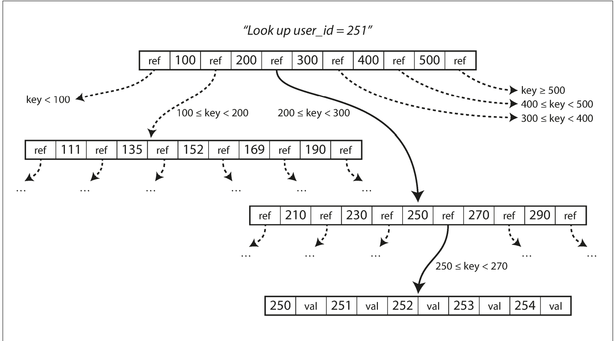
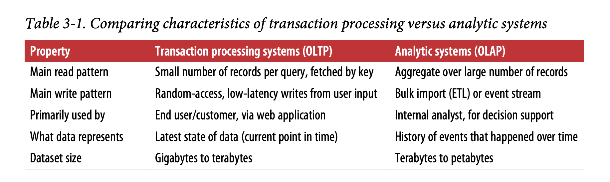
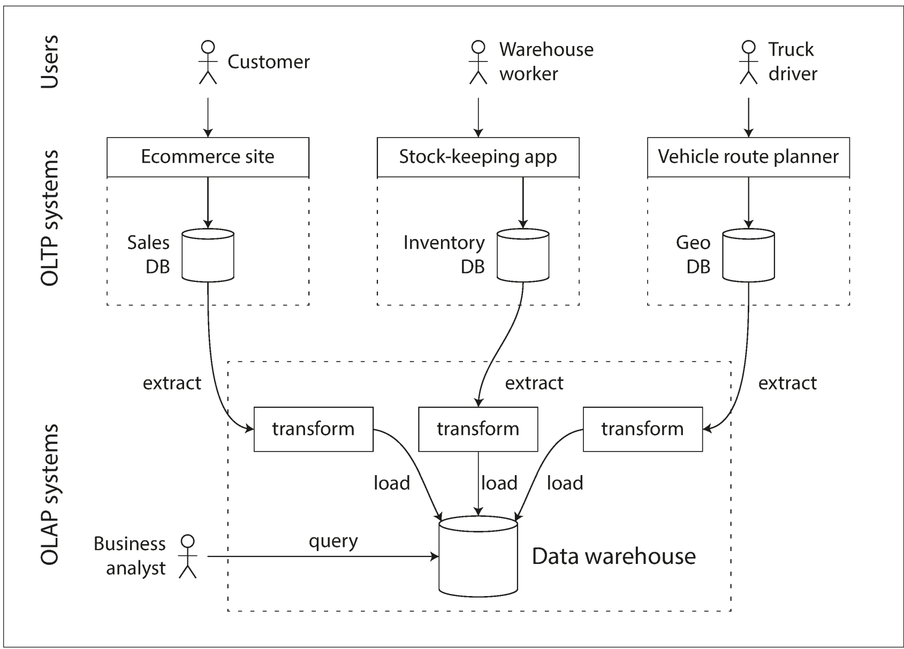

# Storage and Retrieval

## Log storage and hash-table indexes

Storages for the transaction workloads vs analytics.

Log-structured storage engines and page-oriented storage engines (e.g. B-trees)

Log - append only sequence of records.

Hash-indexes - key - the value, value is offset in the file. That approach is used in the **Bitcask** (the default storage engine in **Riak**).

Storage file may be divided into a segments. There's also compaction process, that runs as a background job and generates a new segments without duplicates. While running a job, old segments is used. When the job is finished, old segments are deleted and search goes on new.

Pros:
- log files are append-only and immutable.
- append only is better than random write.
- concurrency and crash recovery are much simpler
- merging old segments avoids the problem of data files getting fragmented over time

Limitations:
- the hash table must fit in memory
- range queries are not efficient

## SSTables and LSM-Trees

Sorted String Table, or SSTable
 - key-value pairs in the log file are sorted by key
 - each key only appears once within each merged segment file
 - **mergesort** algorithm is used
 - we can use binary search if all records have the same size, or keep index of several keys to increase efficiency of the direct search. 
 - file can be grouped into a compressed blocks, which is optimize I/O bandwidth and saving disk space.

Writes in SSTables:
- writes goes into balanced tree structure in memory (RB-trees or AVL trees) - it's called **memtable**
- when in-memory structure reaches to the limit, it's flushed to a file in sorted order
- search is performed in the **memtable** first
- from time to time, run a merging and compaction process in the background to combine segment files and to discard overwritten or deleted values
- we also need to keep a backup of the **memtable** in the file

That is used in the **LevelDB** and **RocksDB**, **Cassandra**, **HBase**.
**Lucene**, an indexing engine for full-text search used by **Elasticsearch** and **Solr**, uses a similar method for storing its term dictionary.

## B-Trees indexes
They are the standard index implementation in almost all relational databases, and many nonrelational databases use them too.
- uses small blocks (4 KB) or pages
- each page has a ref
- refs are used to construct a tree of pages
- write-ahead log is used to avoid corruption of the data. That log is used to restore b-tree index


*B-tree index of pages*

### Other indexes
Clustered index - storing data along with key
Nonclustered index - storing reference to the data with key

## In-memory databases
- VoltDB, MemSQL, and Oracle TimesTen are in-memory databases with a relational model.
- RAMCloud is an open source, in-memory key-value store with durability 
- Redis and Couchbase provide weak durability by writing to disk asynchronously.

## Transaction Processing or Analytics?
**(OLTP) online transaction processing**
```
A transaction needn’t necessarily have ACID (atomicity, consis‐
tency, isolation, and durability) properties. Transaction processing
just means allowing clients to make low-latency reads and writes—
as opposed to batch processing jobs, which only run periodically
(for example, once per day).
```

**OLAP online analytic processing**
Analytics processing usually performed on a huge amount of records with reading of few columns and doing aggregation function on them.



### Data Warehousing
Extract–Transform–Load (ETL) - process of data transformation from the OLTP into the OLAP schema.



**Snowflake schema**

Fact table - table where a record is a particular event (e.g. sale, site view etc).
Dimension table - record represent the who, what, where, when, how, and why of the event.

The idea behind **column-oriented storage** is simple: don’t store all the values from one
row together, but store all the values from each column together instead.

Used in Google’s Dremel.