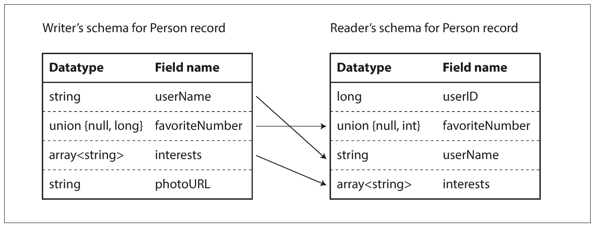

# Encoding and Evolution

Encoding - *serialization* or *marshalling*, is a translation from the in-memory representation to a byte sequence.

- JSON, XML, CSV
- Binary encoding

### Binary
MessagePack, BSON, BJSON, UBJSON, BISON

Apache Thrift and Protocol Buffers - binary encoding libraries with schema.

Avro - is another binary encoding format that is interestingly different from Protocol Buffers and Thrift.

Avro forward and backward compatibility depends on "reader" and "writer" schemas versions, and the rules, of how to transform one into another.

## Distributed actor frameworks
The actor model is a programming model for concurrency in a single process.

Three popular distributed actor framework:
- Akka
- Orleans
- Erlang OTP