# Distributed Data

Reasons of distribution:
- Scalability
- Fault tolerance/high availability
- Latency

Vertical scaling (Scale up) vs horizontal scaling.

## Replication Versus Partitioning
Replication - Keeping a copy of the same data on several different nodes, potentially in different locations.

Partitioning - Splitting a big database into smaller subsets called partitions so that different partitions can be assigned to different nodes (also known as sharding).

## Replication
- To keep data geographically close to your users (and thus reduce latency)
- To allow the system to continue working even if some of its parts have failed (and thus increase availability)
- To scale out the number of machines that can serve read queries (and thus increase read throughput)

### Leader-based replication

- One of the replicas is designated the leader. Clients sends write requests to it, and it stores new data into its own storage.
- The other replicas are known as followers. Whenever the leader writes new data to its local storage, it also sends the data change to all of its followers as part of a replication log or change stream.
- When a client wants to read from the database, it can query either the leader or any of the followers.

#### Synchronous Versus Asynchronous Replication
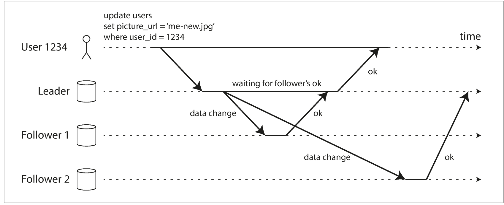
**Semi-synchronous** - is when only one follower is sync, and other are async. And if sync follower fails, one of async followers becomes sync. This strategy guarantee that there're 2 nodes with consistent data at one moment.

#### Setting Up New Followers
1. Take a consistent snapshot of the leader’s database at some point in time—if possible, without taking a lock on the entire database.
2. Copy the snapshot to the new follower node.
3. The follower connects to the leader and requests all the data changes that have happened since the snapshot was taken. This requires that the snapshot is associated with an exact position in the leader’s replication log. That position has various names: for example, PostgreSQL calls it the log sequence number, and MySQL calls it the binlog coordinates.
4. When the follower has processed the backlog of data changes since the snapshot, we say it has caught up. It can now continue to process data changes from the leader as they happen.

#### Handling Node Outages
**Follower failure: Catch-up recovery** - when a follower had a failure, it can return to the processing requests by its log - asking the leader about transactions, that were from the moment when the follower went down.

**Leader failure: Failover** - failover - promotion of the follower to a leader.
1. Determining that the leader has failed.
2. Choosing a new leader.
3. Reconfiguring the system to use the new leader. (If the old leader comes back, it might still believe that it is the leader,
not realizing that the other replicas have forced it to step down. The system needs to ensure that the old leader becomes a follower and recognizes the new leader.)

**Failover corner cases**
- If asynchronous replication is used, the new leader may not have received all the writes from the old leader before it failed. 
- Split brain - two nodes think that they are both leaders and accept writes.
- The right timeout before the leader is declared dead.

### Implementation of Replication Logs
#### Statement-based replication
In the simplest case, the leader logs every write request (statement) that it executes and sends that statement log to its followers. Maybe a problems with statements, that use non-deterministic functions (NOW, RAND etc.).

#### Write-ahead log (WAL) shipping
Shipping logs, that are used in SSTables and LSM-Trees or B-Trees to followers.

#### Logical (row-based) log replication
Special log for replication, that's decoupled from the storage engine.

#### Trigger-based replication
Allows to move replication logic to the application layer.

## Problems with Replication Lag
If an application reads from an asynchronous follower, it may see outdated information if the follower has fallen behind.

### Reading Your Own Writes
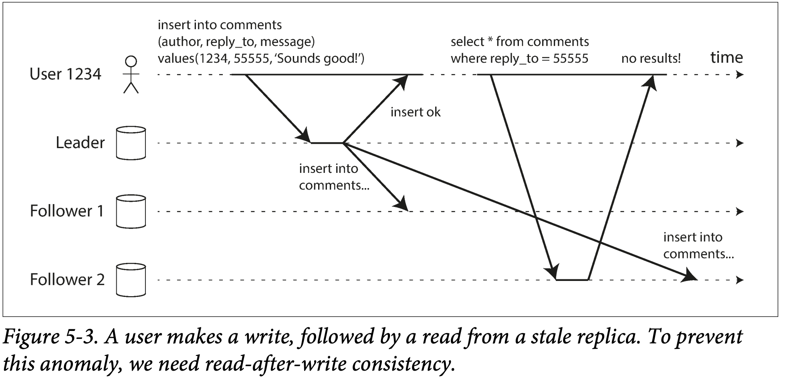
- When reading something that the user may have modified, read it from the leader; otherwise, read it from a follower.
-  You could also monitor the replication lag on followers and prevent queries on any follower that is more than one minute behind the leader.
-  The client can remember the timestamp of its most recent write—then the system can ensure that the replica serving any reads for that user reflects updates at least until that timestamp

### Monotonic Reads
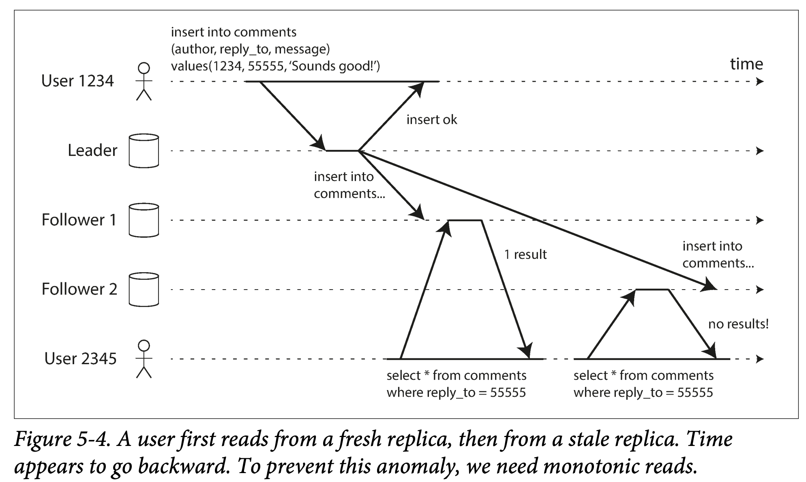
A fix - route users to replicas that way, that each user uses the same replica for all his requests.

### Consistent Prefix Reads
Violation of causality.
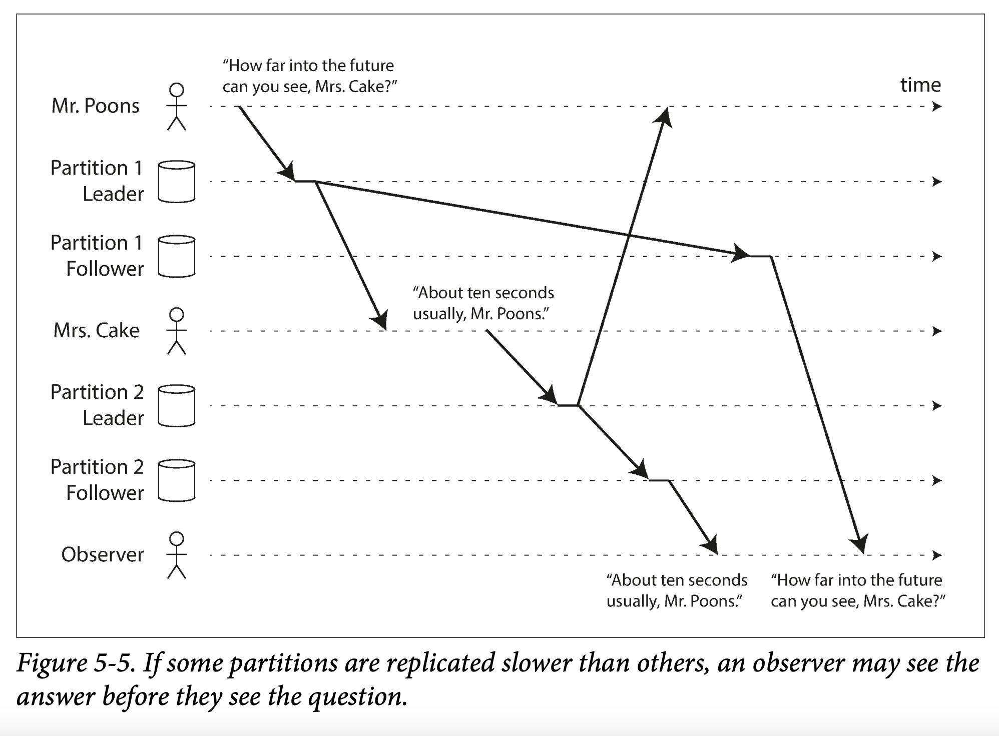

## Multi-Leader Replication
### Use Cases for Multi-Leader Replication
- Multi-datacenter operation
  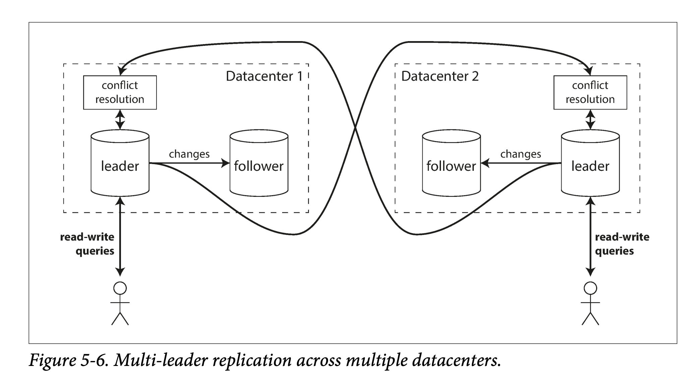
- Clients with offline operation (e.g. calendar app on different devices without stable access to the internet)
- Collaborative editing

### Handling Write Conflicts
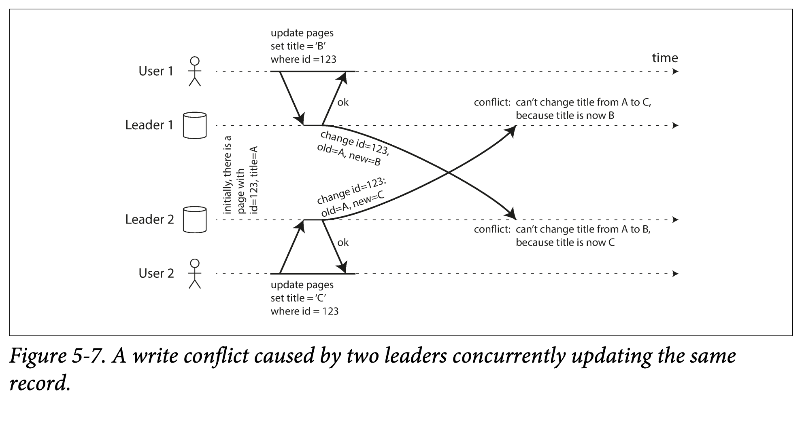

#### Synchronous versus asynchronous conflict detection
Sync conflict detection - wait until all writes happens - If you want synchronous conflict detection, you might as well just use single-leader replication.

#### Conflict avoidance
All writes to the one records goes through one leader.

#### Converging toward a consistent state
- Give each write a unique ID (e.g., a timestamp, a long random number, a UUID, or a hash of the key and value), pick the write with the highest ID as the winner,
and throw away the other writes. If a timestamp is used, this technique is known as last write wins (LWW). Although this approach is popular, it is dangerously prone to data loss.
- Give each replica a unique ID, and let writes that originated at a higher numbered replica always take precedence over writes that originated at a lower numbered replica. This approach also implies data loss.
- Somehow merge the values together—e.g., order them alphabetically and then concatenate them.
- Record the conflict in an explicit data structure that preserves all information, and write application code that resolves the conflict at some later time (perhaps by prompting the user).

#### Custom conflict resolution logic
Resolving code may be executed on read or on write of the conflict data.

#### Automatic Conflict Resolution
- Conflict-free replicated datatypes (CRDTs) are a family of data structures for sets, maps, ordered lists, counters, etc. that can be concurrently edited by multiple users, and which automatically resolve conflicts in sensible ways. Some CRDTs have been implemented in Riak 2.0.
- Mergeable persistent data structures track history explicitly, similarly to the Git version control system, and use a three-way merge function (whereas CRDTs use two-way merges).
- Operational transformation is the conflict resolution algorithm behind collaborative editing applications such as Etherpad and Google Docs. It was designed particularly for concurrent editing of an ordered list of items, such as the list of characters that constitute a text document.

### Multi-Leader Replication Topologies
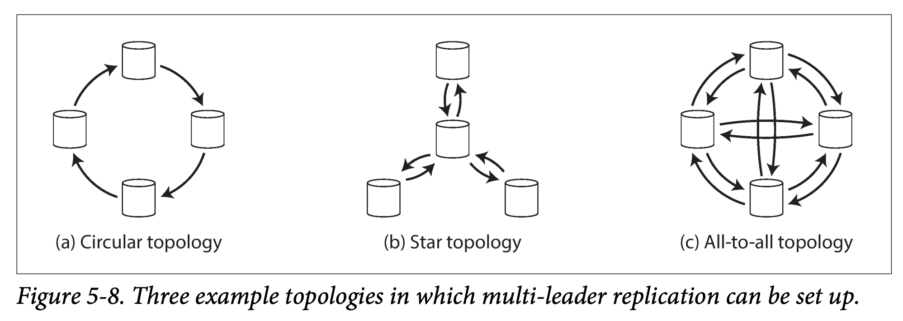

Problem with all-to-all topology:
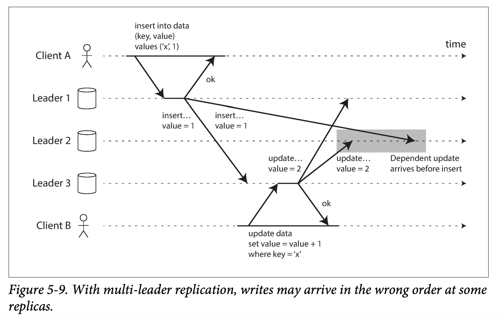

## Leaderless Replication
Amazon used it for its in-house Dynamo system. Riak, Cassandra, and Voldemort are open source datastores with leaderless replication models inspired by Dynamo, so this kind of database is also known as Dynamo-style.

### Writing to the Database When a Node Is Down
Client writes to all nodes and reads from several nodes.
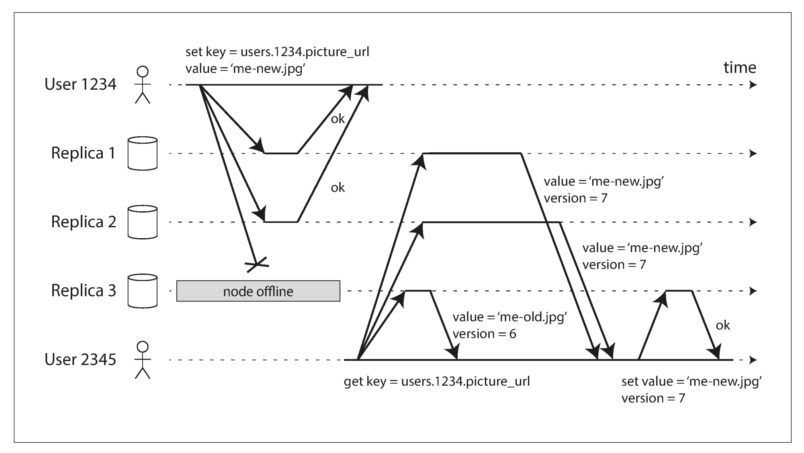

#### Read repair and anti-entropy
*Read repair*
When a client makes a read from several nodes in parallel, it can detect any stale responses. For example, user 2345 gets a version 6 value from replica 3 and a version 7 value from replicas 1 and 2. The client sees that replica 3 has a stale value and writes the newer value back to that replica. This approach works well for values that are frequently read.

*Anti-entropy process*
Some datastores have a background process that constantly looks for
differences in the data between replicas and copies any missing data from one replica to another. Unlike the replication log in leader-based replication, this anti-entropy process does not copy writes in any particular order, and there may be a significant delay before data is copied.

#### Quorums for reading and writing
r + w > n where
r - min read nodes amount
w - min write nodes amount
n - total nodes amount

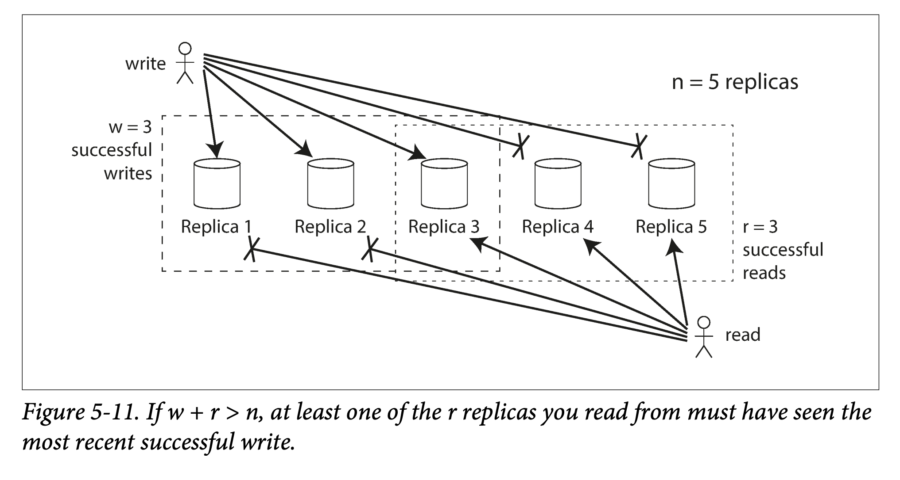

### Sloppy Quorums and Hinted Handoff
**Sloppy quorum:**
- Is it better to return errors to all requests for which we cannot reach a quorum of w or r nodes?
- Or should we accept writes anyway, and write them to some nodes that are reachable but aren’t among the n nodes on which the value usually lives?

**Hinted Handoff** - accepting writes even if the amount of write responses < w, and then handoff values to the other nodes when they are back to live.

### Detecting Concurrent Writes
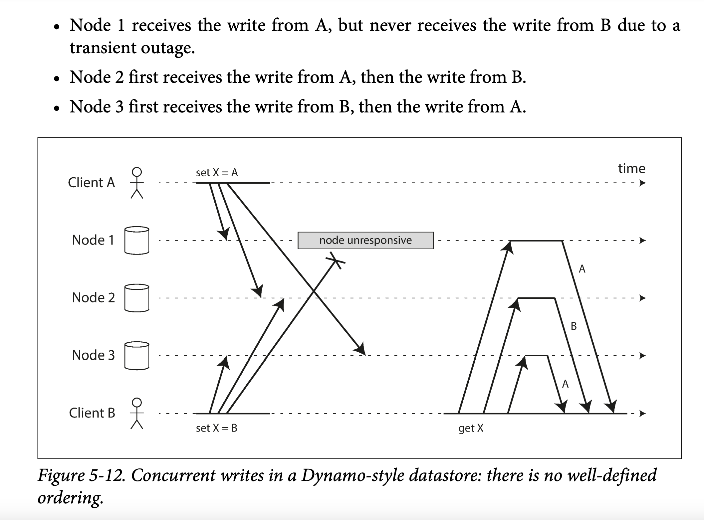

#### Last write wins (LWW, discarding concurrent writes)
Writes must have a timestamp.

#### The “happens-before” relationship and concurrency
Two operations are concurrent if neither happens before the other (i.e. neither knows about the other).

Whenever you have two operations A and B, there are three possibilities: 
- either A happened before B
- B happened before A
- A and B are concurrent. 
What we need is an algorithm to tell us whether two operations are concurrent or not. If one operation happened before another, the later operation should overwrite the earlier operation, but if the operations are concurrent, we have a conflict that needs to be
resolved.

#### Capturing the happens-before relationship
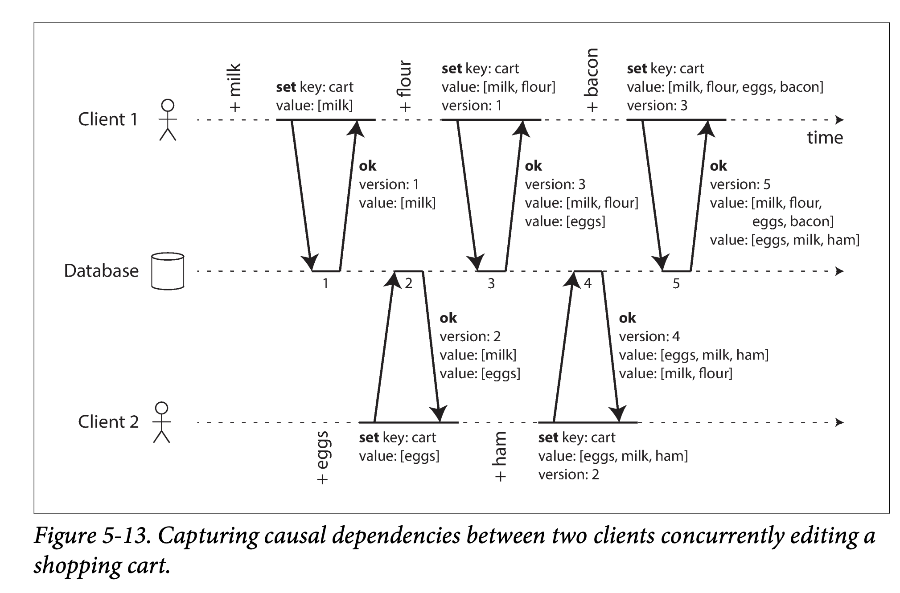
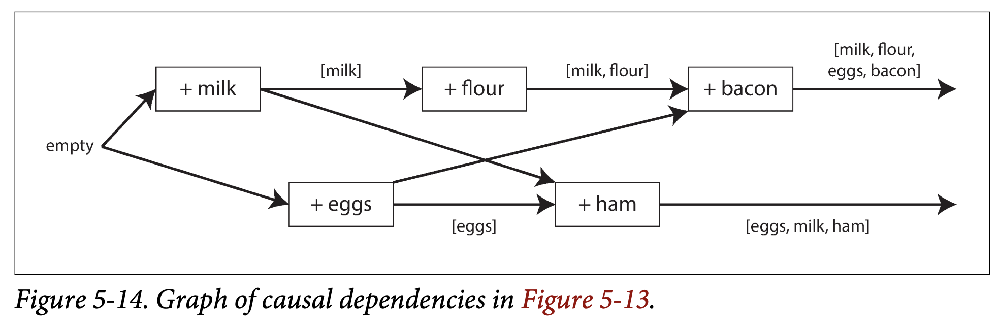

**The detection algorithm:**

1. The server maintains a version number for every key, increments the version number every time that key is written, and stores the new version number along with the value written.
2. When a client reads a key, the server returns all values that have not been overwritten, as well as the latest version number. A client must read a key before writing.
3. When a client writes a key, it must include the version number from the prior read, and it must merge together all values that it received in the prior read. (The response from a write request can be like a read, returning all current values, which allows us to chain several writes like in the shopping cart example.)
4. When the server receives a write with a particular version number, it can overwrite all values with that version number or below (since it knows that they have been merged into the new value), but it must keep all values with a higher version number (because those values are concurrent with the incoming write).

##### Version vectors
We need to use a version number per replica as well as per key. The collection of version numbers from all the replicas is called a version vector.